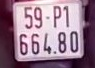
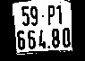

# License Plate Recognition

This project crops license plate by basic algorithm and recognizes digits by tessaract model.

<figcaption> Original Image </figcaption>

\\

<figcaption>Result from croped algorithm</figcaption>

\\

<figcaption>Take threshold, then Tessaract read text: "59-P1 664.80"</figcaption>

